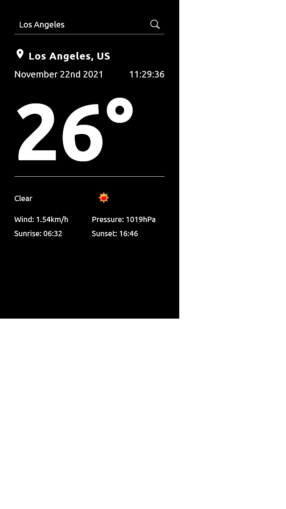

# Current Weather and Time Around the World

- shows current weather based on user's location
- uses OpenWeatherMap API to get weather data
- allows user to enter city name to check current weather and time there
- uses moment.js and lodash
- debounce function to limit api calls when entering city name
- dark theme
- material icons
- shows wind speed, sunrise and sunset times
- displays an icon based on current temperature

[LIVE VERSION](https://kmkukla.github.io/current-weather-and-time-around-the-world/dist/)

